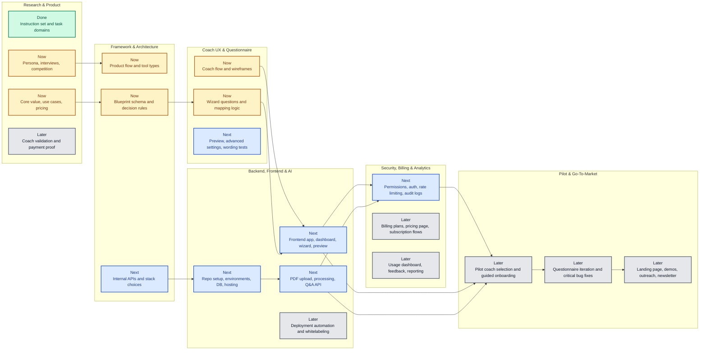

# Project Roadmap Swimlanes

This roadmap groups the work into major swimlanes and shows the execution structure for the project.

The live task status now lives in `.github/instructions/*.instructions.md`.

For the public live view, open `docs/index.html` locally or use `https://paas.ciuculescu.com/`.

## Live Status Source

- Source of truth: `.github/instructions/*.instructions.md`
- Required section in each file: `## Task Status`
- Supported status values: `done`, `in_progress`, `blocked`, `not_started`
- Public frontend: reads those instruction files from the `main` branch on every page load

## Swimlane View

## Recommended Execution Order

1. Finish research and product clarification.
2. Lock the architecture, blueprint, and questionnaire logic.
3. Design the coach UX flow and validate wireframes.
4. Build the platform foundations across backend, frontend, and AI.
5. Add security controls before exposing the product widely.
6. Run a pilot, then expand into billing, analytics, and go-to-market.

## How To Open It

1. Open [docs/roadmap-swimlanes.md](docs/roadmap-swimlanes.md).
2. In VS Code, run `Markdown: Open Preview` or press `Ctrl+Shift+V`.
3. If you want side-by-side preview, use `Markdown: Open Preview to the Side`.
4. For the live public dashboard, open [docs/index.html](docs/index.html) or `https://paas.ciuculescu.com/`.